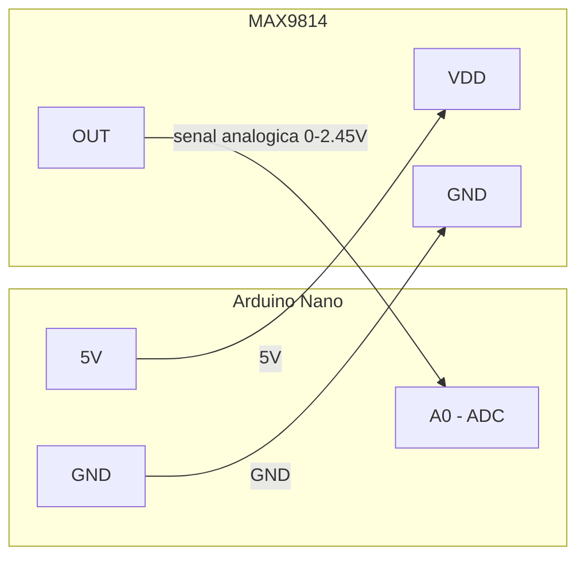

# Test MAX9814 — Módulo de Micrófono

Validación del camino de **entrada de audio**: el micrófono MAX9814 con AGC entrega una señal analógica al ADC del Arduino, que la digitaliza y la vuelca al monitor serial.

## Componentes

| Componente | Descripción |
|------------|-------------|
| Arduino Nano | Microcontrolador ATmega328P |
| MAX9814 | Micrófono electret con amplificador y AGC |
| (opcional) Altavoz / PC | Para escuchar la grabación de prueba |

## Conexiones



| Arduino | MAX9814 | Descripción |
|---------|---------|-------------|
| A0 | OUT | Salida analógica al ADC |
| 5V | VDD | Alimentación (2.7–5.5 V) |
| GND | GND | Tierra común |

## Sobre el Módulo

**MAX9814 — Amplificador de micrófono con AGC**
- Salida analógica 0–2.45 V (offset de 1.25 V en silencio, **no es cero**).
- Ganancia seleccionable 40/50/60 dB vía pin `Gain` (flotante = 60 dB).
- Respuesta en frecuencia: 20 Hz – 20 kHz.
- Pin `AR` (attack/release ratio): flotante = 1:4000, VDD = 1:2000, GND = 1:500.
- [Datasheet](https://www.analog.com/media/en/technical-documentation/data-sheets/max9814.pdf)

## Uso

> Requisitos previos: toolchain AVR, Python. Ver [Configuración del Entorno](../../README.md#configuración-del-entorno) en el README principal.

Este directorio contiene **dos pruebas** que usan toolchains distintos:

| Test | Toolchain | Para qué | Baud |
|---|---|---|---|
| `test_max9814.c` | avr-gcc + Makefile | Monitor en vivo del ADC (raw, min/max, peak-to-peak) | **9600** |
| `record_max9814/` | Arduino IDE | Grabación de audio real a archivo `.wav` | **115200** |

> ⚠️ **Inconsistencia de baud conocida:** los dos tests usan bauds distintos. El Makefile de `test_max9814.c` está fijado a 9600, mientras que `record_max9814.ino` hardcodea `Serial.begin(115200)`. Conectar el monitor al baud que corresponde a cada programa o las lecturas son ilegibles.

### Test en vivo (`test_max9814.c`)

```bash
make upload
make monitor        # 9600 baud
```

Salida esperada en el monitor serial:

```
Raw: 512 | Min: 500 | Max: 524 | Peak-to-Peak: 24
```

Valores típicos:
- **Silencio:** Raw ~512 (1.25 V), Peak-to-Peak bajo (5–20).
- **Hablar normal:** Peak-to-Peak 50–200.
- **Sonido fuerte:** Peak-to-Peak 200–500+.

Si Raw está alrededor de 512 (±50) en silencio, el módulo funciona correctamente.

### Grabación a WAV (`record_max9814/`)

Captura 5 segundos de audio y los guarda en `grabacion.wav` en la PC. Ver instructivo detallado en [`record_max9814/README.md`](record_max9814/README.md).

## Solución de Problemas

**Raw está en 0 o en 1023 fijo**
- Verificar OUT → A0 y alimentación del módulo.

**No hay variación (Peak-to-Peak siempre 0)**
- Asegurarse de que el micrófono está recibiendo sonido (hablar cerca).
- Revisar soldaduras del módulo.

**La grabación suena saturada o muy baja**
- Ajustar ganancia con el pin `Gain`: GND = 50 dB, VDD = 40 dB (por defecto flotante = 60 dB).

## Referencias

- [Datasheet MAX9814](https://www.analog.com/media/en/technical-documentation/data-sheets/max9814.pdf)
- [Adafruit MAX9814 Guide](https://learn.adafruit.com/adafruit-agc-electret-microphone-amplifier-max9814)
