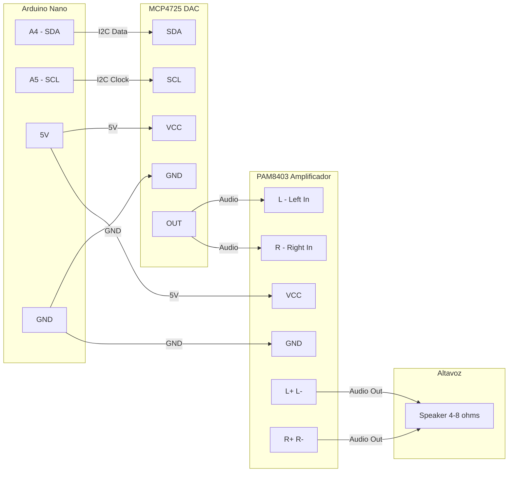

# Test MCP4725 DAC + PAM8403 Amplificador

Proyecto de prueba para generar audio usando el DAC MCP4725 y reproducirlo a traves del amplificador PAM8403.

## Componentes

| Componente | Descripcion |
|------------|-------------|
| Arduino Nano | Microcontrolador ATmega328P |
| MCP4725 | DAC I2C de 12 bits |
| PAM8403 | Amplificador estereo Clase D 3W+3W |
| Altavoz | 4-8 ohms |

## Diagrama de Conexiones (Mermaid)



## Diagrama de Conexiones (Texto)

```
                    ARDUINO NANO
                   +------------+
                   |            |
              A4 --|  SDA  -----+-----------------+
              A5 --|  SCL  -----+---------------+ |
              5V --|  VCC  -----+-------------+ | |
             GND --|  GND  -----+-----------+ | | |
                   |            |           | | | |
                   +------------+           | | | |
                                            | | | |
                        MCP4725 DAC         | | | |
                   +------------------+     | | | |
                   |                  |     | | | |
              GND -|- GND <-----------+-----+ | | |
              VCC -|- VCC <-----------+-------+ | |
              SCL -|- SCL <-----------+---------+ |
              SDA -|- SDA <-----------+-----------+
              OUT -|- OUT ----+       |
                   |          |       |
                   +----------|-------+
                              |
                              | (senal analogica 0-5V)
                              |
                      PAM8403 AMPLIFICADOR
                   +------------------+
                   |          |       |
               L --|- L  <----+       |
               R --|- R  <----+       |
             GND --|- GND <-----------+-- (tierra comun)
             VCC --|- VCC <-----------+-- (5V desde Arduino o fuente)
                   |                  |
              L+ --|- L+  ----|       |
              L- --|- L-  ----|       |
              R+ --|- R+  ----+--> ALTAVOZ (4-8 ohms)
              R- --|- R-  ----|       |
                   |                  |
                   +------------------+


    Flujo de senal:
    ===============

    [Arduino Nano]     [MCP4725]      [PAM8403]      [Altavoz]
         |                |              |              |
         |   I2C (SDA)    |              |              |
         |--------------->|              |              |
         |   I2C (SCL)    |              |              |
         |--------------->|              |              |
         |                |              |              |
         |                |  Analogico   |              |
         |                |------------->|              |
         |                |   (0-5V)     |              |
         |                |              |  Amplificado |
         |                |              |------------->|
         |                |              |   (3W max)   |
```

## Tabla de Conexiones

### Arduino Nano -> MCP4725

| Arduino Nano | MCP4725 | Descripcion |
|--------------|---------|-------------|
| A4           | SDA     | Linea de datos I2C |
| A5           | SCL     | Linea de reloj I2C |
| 5V           | VCC     | Alimentacion |
| GND          | GND     | Tierra |

### MCP4725 -> PAM8403

| MCP4725 | PAM8403 | Descripcion |
|---------|---------|-------------|
| OUT     | L       | Entrada canal izquierdo |
| OUT     | R       | Entrada canal derecho |
| GND     | GND     | Tierra comun |

### PAM8403 -> Altavoz

| PAM8403 | Altavoz | Descripcion |
|---------|---------|-------------|
| L+ / L- | +/-     | Canal izquierdo |
| R+ / R- | +/-     | Canal derecho |

## Sobre los Modulos

### MCP4725 - DAC I2C

- **Tipo**: Convertidor Digital-Analogico de 12 bits
- **Interfaz**: I2C (direccion por defecto 0x60)
- **Resolucion**: 4096 niveles (0-4095)
- **Voltaje de salida**: 0V a VCC (tipicamente 0-5V)
- **Velocidad I2C**: 100kHz, 400kHz o 3.4MHz
- **Caracteristica**: EEPROM interno para guardar valor al apagar

### PAM8403 - Amplificador

- **Tipo**: Amplificador estereo Clase D
- **Potencia**: 3W + 3W (total 6W)
- **Alimentacion**: 2.5V - 5.5V DC (recomendado 5V)
- **Impedancia de carga**: 4 ohms u 8 ohms
- **Ganancia**: 24dB maximo
- **Proteccion**: Cortocircuito y termica integrada
- **Eficiencia**: >90% (Clase D)

## Instalacion de Herramientas

### Linux (Debian/Ubuntu)
```bash
sudo apt-get update
sudo apt-get install gcc-avr avr-libc avrdude make screen
```

### Arch Linux
```bash
sudo pacman -S avr-gcc avr-libc avrdude make screen
```

### macOS
```bash
brew tap osx-cross/avr
brew install avr-gcc avrdude
```

## Compilacion

```bash
make
```

Esto genera el archivo `.hex` listo para cargar al Arduino.

## Cargar al Arduino

1. Conecta tu Arduino Nano al puerto USB
2. Verifica/ajusta el puerto en el Makefile (variable `PORT`)
3. Carga el programa:

```bash
make upload
```

## Monitorear la Salida

```bash
make monitor
```

O usa el monitor serial de Arduino IDE a 9600 baudios.

## Comandos del Menu

| Tecla | Accion |
|-------|--------|
| `1`   | Onda senoidal |
| `2`   | Onda cuadrada |
| `3`   | Onda triangular |
| `4`   | Onda diente de sierra |
| `5`   | Silencio |
| `+`   | Aumentar frecuencia |
| `-`   | Disminuir frecuencia |
| `t`   | Test barrido de frecuencias |
| `w`   | Test de todas las ondas |
| `h`   | Mostrar menu de ayuda |

## Que Esperar

Al iniciar el programa:

1. Se verifica la comunicacion I2C con el MCP4725
2. Se muestra el menu de comandos
3. Se inicia la generacion de onda senoidal por defecto

### Sonidos esperados:

- **Senoidal**: Tono puro, suave
- **Cuadrada**: Tono mas aspero, con armonicos
- **Triangular**: Tono intermedio
- **Diente de sierra**: Similar a instrumentos de cuerda

### Frecuencia aproximada:

La frecuencia depende del delay configurado. Con 64 muestras por ciclo:
- Delay 500us -> ~31 Hz (muy grave)
- Delay 100us -> ~156 Hz (grave)
- Delay 50us -> ~312 Hz (medio)

## Solucion de Problemas

### No hay sonido

1. Verifica las conexiones fisicas
2. Asegurate que el MCP4725 responde (mensaje "OK!" al iniciar)
3. Verifica que el PAM8403 tiene alimentacion
4. Prueba con el test de barrido (tecla `t`)

### Error de comunicacion I2C

1. Verifica SDA -> A4, SCL -> A5
2. Algunos modulos MCP4725 usan direccion 0x62 en lugar de 0x60
3. Modifica `MCP4725_ADDR` en el codigo si es necesario

### Sonido distorsionado

1. Reduce el volumen si el PAM8403 tiene potenciometro
2. Verifica que la alimentacion es estable (usa capacitores)
3. Evita usar protoboard (causa distorsion)

## Limpieza

```bash
make clean
```

## Referencias

- [Datasheet MCP4725](https://ww1.microchip.com/downloads/en/devicedoc/22039d.pdf)
- [Datasheet PAM8403](https://www.mouser.com/datasheet/2/115/PAM8403-247318.pdf)
- [Adafruit MCP4725 Tutorial](https://learn.adafruit.com/mcp4725-12-bit-dac-tutorial)
- [Components101 PAM8403](https://components101.com/modules/pam8403-stereo-audio-amplifier-module)
