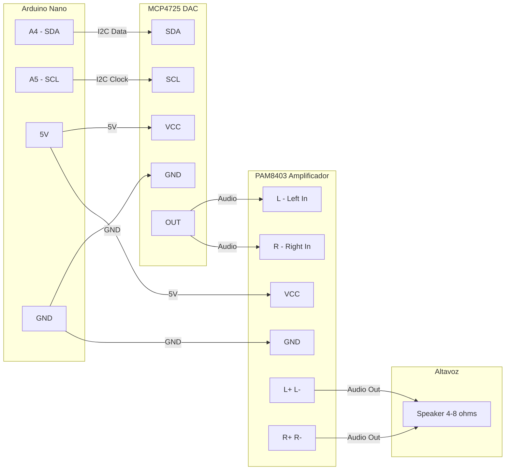

# Test MCP4725 DAC + PAM8403 Amplificador

Validación del camino de **salida de audio**: el MCU envía muestras por I2C al DAC MCP4725, que entrega una señal analógica al amplificador PAM8403, que la reproduce en el altavoz.

## Componentes

| Componente | Descripción |
|------------|-------------|
| Arduino Nano | Microcontrolador ATmega328P |
| MCP4725 | DAC I2C de 12 bits |
| PAM8403 | Amplificador estéreo Clase D 3W+3W |
| Altavoz | 4–8 Ω |

## Conexiones



### Arduino Nano → MCP4725

| Arduino Nano | MCP4725 | Descripción |
|--------------|---------|-------------|
| A4 | SDA | Línea de datos I2C |
| A5 | SCL | Línea de reloj I2C |
| 5V | VCC | Alimentación |
| GND | GND | Tierra |

### MCP4725 → PAM8403

| MCP4725 | PAM8403 | Descripción |
|---------|---------|-------------|
| OUT | L | Entrada canal izquierdo |
| OUT | R | Entrada canal derecho |
| GND | GND | Tierra común |

### PAM8403 → Altavoz

| PAM8403 | Altavoz | Descripción |
|---------|---------|-------------|
| L+ / L- | +/- | Canal izquierdo |
| R+ / R- | +/- | Canal derecho |

## Sobre los Módulos

**MCP4725 — DAC I2C de 12 bits**
- Dirección I2C por defecto `0x60` (algunos módulos usan `0x62`).
- Resolución: 4096 niveles (0–4095), salida 0 V a VCC.
- Soporta Standard (100 kHz), Fast (400 kHz) y High Speed (3.4 MHz). Este test usa Fast Mode.
- EEPROM interno: conserva el último valor al apagar.
- [Datasheet](https://ww1.microchip.com/downloads/en/devicedoc/22039d.pdf)

**PAM8403 — Amplificador Clase D**
- Estéreo 3W + 3W, alimentación 2.5–5.5 V (recomendado 5 V).
- Impedancia de carga 4 u 8 Ω, ganancia 24 dB, eficiencia >90%.
- Protecciones de cortocircuito y térmica integradas.
- [Datasheet](https://www.mouser.com/datasheet/2/115/PAM8403-247318.pdf)

## Uso

> Requisitos previos: toolchain AVR, Python y ffmpeg. Ver [Configuración del Entorno](../../README.md#configuración-del-entorno) en el README principal.

Este directorio contiene **tres programas** seleccionables con `TEST=` (o con los targets del Makefile):

| Programa | Para qué | Cómo cargarlo | Baud |
|---|---|---|---|
| `i2c_scanner` | Verificar la dirección I2C del DAC antes de cualquier test | `make TEST=i2c_scanner upload` | 115200 |
| `test_audio_tones` | Autotest: ondas y melodías vía menú serie interactivo | `make upload` (default) | 115200 |
| `test_audio_stream` | Reproducir audio real desde la PC | `make stream` | 115200 |

### Diagnóstico I2C (`i2c_scanner`)

Útil la primera vez o cuando no hay audio: confirma que el MCP4725 responde y en qué dirección.

```bash
make TEST=i2c_scanner upload
make monitor
```

Salida esperada: una línea `Probando 0xNN: ENCONTRADO!` para cada dispositivo en el bus (típicamente `0x60`, o `0x62` en algunos módulos).

### Test de ondas (`test_audio_tones`)

Generador interactivo de formas de onda para validar el camino DAC → PAM8403 → altavoz sin necesidad de una PC enviando datos.

```bash
make upload
make monitor
```

Menú de comandos (teclas en el monitor serial):

| Tecla | Acción |
|-------|--------|
| `1` | Onda senoidal |
| `2` | Onda cuadrada |
| `3` | Onda triangular |
| `4` | Onda diente de sierra |
| `5` | Silencio |
| `+` / `-` | Subir / bajar frecuencia |
| `t` | Barrido de frecuencias |
| `w` | Ciclar todas las ondas |
| `m` | Melodía (Oda a la Alegría — Beethoven) |
| `h` | Menú de ayuda |

Sonidos esperados: senoidal pura/suave, cuadrada áspera con armónicos, triangular intermedia, diente de sierra similar a cuerdas.

### Test de streaming (`test_audio_stream`)

Reproduce audio real desde la PC. El firmware [`test_audio_stream.c`](test_audio_stream.c) recibe muestras PCM crudas (8-bit unsigned, mono) por UART y las vuelca al DAC en tiempo real. El script [`stream_audio.py`](stream_audio.py) convierte cualquier formato con `ffmpeg` y envía el stream.

**Flujo:**

```bash
uv sync                                                  # 1 vez, desde la raíz del repo
make stream                                              # carga el firmware test_audio_stream
make play FILE=../../audio-samples/grabacion-prueba.flac # reproduce
```

> `audio-samples/` está gitignored (solo se versionea `.gitkeep`). Usá cualquier `.wav`, `.mp3`, `.ogg`, `.flac`, etc.

**Sample rate efectivo:** lo fija el baud UART, `BAUD/10`. A 115200 → ~11520 Hz. Para otras frecuencias, `make play FILE=... "BAUD=230400"` o `uv run stream_audio.py <file> --baud 230400`.

**Protocolo** (firmware ↔ script):

```
PC  → MCU: 0xAA               (sync request)
MCU → PC : 0x55               (sync ack)
PC  → MCU: 4 bytes length LE  (cantidad de muestras)
PC  → MCU: N bytes PCM        (stream, ritmo dado por el baud)
MCU → PC : 0x44               (done)
```

**Diagnóstico:**

| Síntoma | Causa probable |
|---|---|
| `No llegó SYNC_ACK` | Firmware incorrecto cargado (no es `test_audio_stream`) |
| `No llegó DONE_ACK` | Stream cortado: archivo muy largo o USB desconectado |
| `Completado en X.XXs` | Éxito |

## Solución de Problemas

**No hay sonido**
1. Verificar conexiones físicas (SDA→A4, SCL→A5).
2. Correr `i2c_scanner` para confirmar que el MCP4725 responde y su dirección.
3. Verificar alimentación del PAM8403.

**Error de comunicación I2C**
- Algunos módulos MCP4725 usan dirección `0x62` en lugar de `0x60`. Ajustar `MCP4725_ADDR` en [`drivers/mcp4725.h`](../../drivers/mcp4725.h).

**Sonido distorsionado**
1. Si el PAM8403 tiene potenciómetro, bajar el volumen.
2. Verificar alimentación estable (usar capacitores de desacoplo).
3. Evitar protoboard (introduce resistencia y ruido).

## Referencias

- [Datasheet MCP4725](https://ww1.microchip.com/downloads/en/devicedoc/22039d.pdf)
- [Datasheet PAM8403](https://www.mouser.com/datasheet/2/115/PAM8403-247318.pdf)
- [Adafruit MCP4725 Tutorial](https://learn.adafruit.com/mcp4725-12-bit-dac-tutorial)
- [Components101 PAM8403](https://components101.com/modules/pam8403-stereo-audio-amplifier-module)
