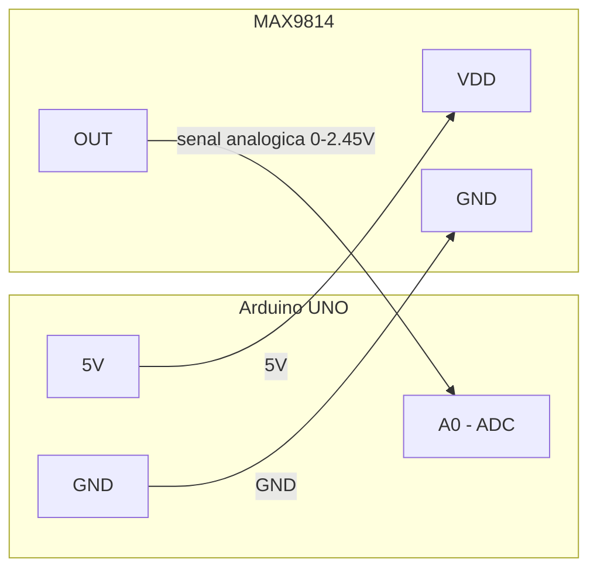

# Test MAX9814 — Micrófono (bare-metal en C)

Prueba de la **entrada de audio**: el MAX9814 entrega una señal analógica al ADC del Arduino UNO, que la digitaliza y la envía por UART a la PC. Es la versión **bare-metal en C**; la variante con la API de Arduino (`.ino`) está en [`../test_microphone_ino/`](../test_microphone_ino/).

## Conexiones



| Arduino | MAX9814 | Descripción |
|---------|---------|-------------|
| A0 | OUT | Salida analógica al ADC |
| 5V | VDD | Alimentación (2.7–5.5 V) |
| GND | GND | Tierra común |

> En silencio el módulo reposa en ~1.25 V (**no** en 0). La ganancia se elige con el pin `Gain`: al aire = 60 dB, GND = 50 dB, VCC = 40 dB.

## Programas

| Archivo | Para qué |
|---|---|
| `test_max9814.c` | Monitor en vivo del ADC por serie (para verificar el cableado) |
| `record_max9814.c` | Graba audio a 8 kHz (Timer1 + ISR) y lo manda crudo por UART → `.wav` |

Seleccionar el programa en el `Makefile` (`TARGET` y `TEST_SRC`) y ejecutar:

```bash
make upload                              # compila y flashea al Arduino
uv run ../record_audio.py  # graba 5 s -> grabacion.wav (solo record_max9814)
make monitor                             # ver el ADC en vivo (solo test_max9814)
```

> Requisitos previos (toolchain AVR y Python/uv): ver [Configuración del Entorno](../../README.md#configuración-del-entorno).

## Problemas comunes

| Síntoma | Causa / solución |
|---|---|
| Valor fijo en 0 o 1023 | Revisar OUT→A0 y la alimentación del módulo |
| No cambia al hablar | Hablar cerca; revisar soldaduras del módulo |
| Suena a ruido/distorsión | **Clipping** por ganancia alta: reducir la ganancia con el pin `Gain` a VCC (40 dB). El firmware está bien si llegan ~8000 bytes/s |

## Referencias

- [Datasheet MAX9814](https://www.analog.com/media/en/technical-documentation/data-sheets/max9814.pdf)
- [Adafruit MAX9814 Guide](https://learn.adafruit.com/adafruit-agc-electret-microphone-amplifier-max9814)
