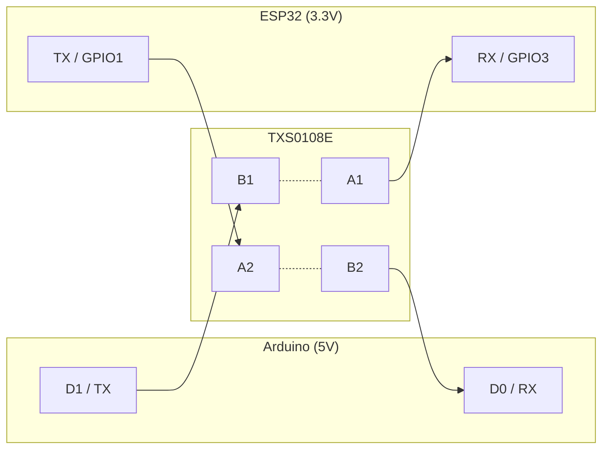
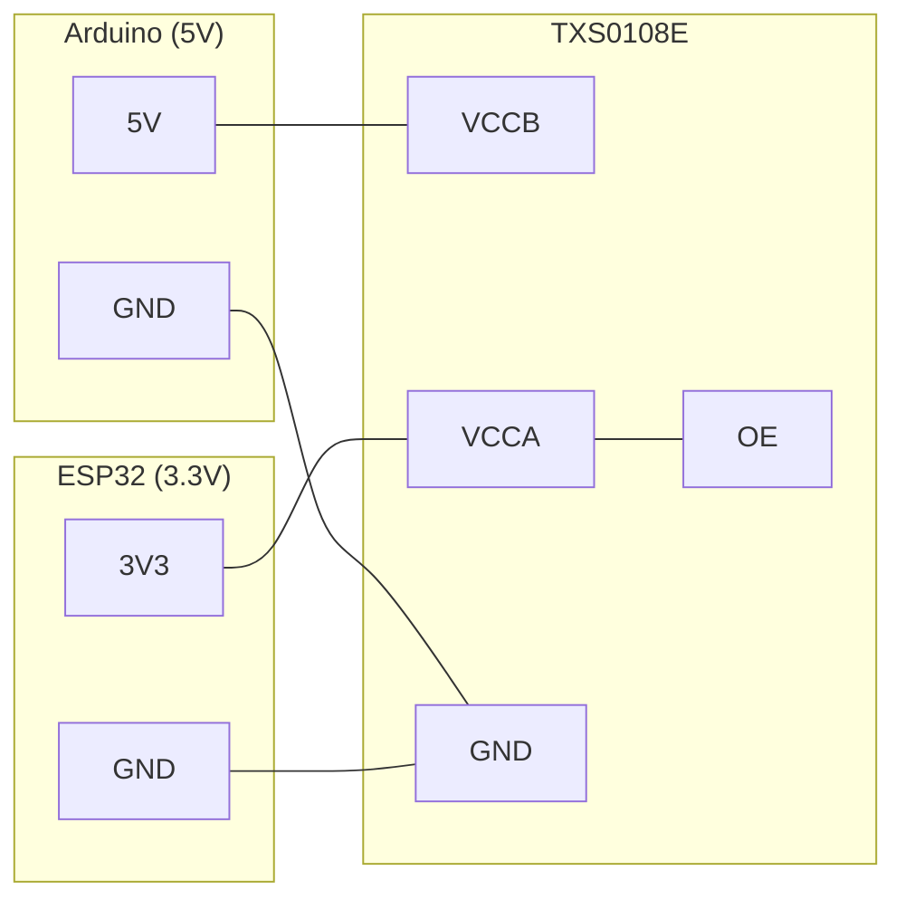

# Test A — uart-bridge (Arduino ↔ ESP por UART)

Valida el **enlace UART físico** entre el Arduino (ATmega328P) y el módulo ESP32/ESP8266 a través del **conversor de nivel lógico**, antes de integrar el Wi-Fi. Es la primera de las etapas del enlace (ver Fase 3 "Wi-Fi Aislada (Tunnel)" en el README principal).

El Arduino transmite un byte que se incrementa, el ESP lo devuelve (eco), y el Arduino compara lo enviado con lo recibido. Así se prueba el camino completo de ida y vuelta a través del conversor.

## Componentes

| Componente | Descripción |
|------------|-------------|
| Arduino Nano/UNO | Microcontrolador ATmega328P (lógica 5V) |
| ESP32 (DevKit) | Módulo Wi-Fi (lógica 3.3V). Portable a ESP8266 |
| Conversor de nivel lógico | **TXS0108E** — traductor bidireccional de 8 bits, 3.3V ↔ 5V, auto-direccional ([datasheet](https://www.ti.com/lit/ds/symlink/txs0108e.pdf)) |
| 2 cargadores USB + cables | Alimentación (uno por placa) |

## Conexiones

Ambas placas usan su **UART de hardware**. El enlace cruza TX↔RX a través del **TXS0108E**. En este shifter el **puerto A es el lado de menor tensión** (ESP 3.3V) y el **puerto B el de mayor** (Arduino 5V); cada canal empareja `Ax ↔ Bx`.

### Datos

Cualquier par de canales sirve; acá se usan el 1 y el 2. Las flechas marcan el sentido de cada señal; `Bx -.- Ax` es el par de canal dentro del shifter.



| Señal | Arduino (5V → lado B) | TXS0108E | ESP (3.3V → lado A) |
|---|---|---|---|
| Datos Arduino→ESP | D1 (TX) | B1 ↔ A1 | RX / GPIO3 |
| Datos ESP→Arduino | D0 (RX) | B2 ↔ A2 | TX / GPIO1 |

### Alimentación y control del shifter

Cada lado del TXS0108E se alimenta con su propia tensión (VCCB=5V, VCCA=3V3), `OE` va a alto para habilitarlo y las tres GND se unen.



| Pin TXS0108E | Conectar a | Nota |
|---|---|---|
| **VCCB** | 5V (Arduino) | lado de mayor tensión |
| **VCCA** | 3V3 (ESP) | lado de menor tensión (debe cumplirse VCCA ≤ VCCB) |
| **OE** | 3V3 / VCCA (alto) | **habilita el chip**; flotante o en bajo → todos los canales en Hi-Z |
| **GND** | GND común | Arduino + ESP + shifter |

> ⚠️ **No agregar pull-ups externos** en las líneas de datos: el TXS0108E ya los tiene (circuito one-shot). Es auto-direccional, no lleva pin de dirección.

> El firmware corre igual en ESP32 y ESP8266 (ambos usan UART0). En **ESP32**, si querés conservar el debug por USB, podés mover el enlace a UART2 (GPIO16/17); ver comentario en `echo/echo.ino`.

## Alimentación

**Cada placa a su propio cargador USB + GND común.** Ninguna placa va conectada a la PC durante el test.

- El **GND común es obligatorio**: sin una tierra compartida entre las dos placas, el UART no funciona.
- No hace falta el "truco" de cross-alimentación: con un cargador (que no enumera por USB) el chip USB-serial del Arduino no pelea la línea D0.
- Cargador de ~1 A para el ESP (picos de Wi-Fi ~430 mA, relevante recién en las etapas siguientes).

## Firmwares

| Archivo | Placa | Rol |
|---|---|---|
| `test_uart_esp.c` | Arduino (avr-gcc) | Envía byte incremental, espera el eco, compara. LED onboard = estado |
| `echo/echo.ino` | ESP (arduino-cli) | Eco por `Serial` (UART0). LED onboard parpadea por cada byte |

## Uso

> Requisitos previos: toolchain AVR (ver [Configuración del Entorno](../../README.md#configuración-del-entorno)) y **arduino-cli** para el ESP (instalar desde https://arduino.github.io/arduino-cli/latest/installation/).

**Flashear se hace con cada placa conectada a la PC de a una, y con los cables del enlace (RX/TX) desconectados** (el flasheo usa esos mismos pines).

### 1. Flashear el ESP

```bash
cd echo
make setup-esp32   # una sola vez: instala el core ESP32
make upload        # con el ESP conectado por USB y RX/GPIO3, TX/GPIO1 desconectados
```

> El board genérico `esp32:esp32:esp32` **no define `LED_BUILTIN`** (a diferencia del core ESP8266), así que el `Makefile` lo inyecta al compilar (GPIO2, el LED onboard de la mayoría de las DevKit). Si tu placa usa otro pin: `make ESP32_LED=<pin> upload`.

> Si el flasheo falla con `Failed to connect to ESP32: No serial data received`, mantené presionado el botón **BOOT** de la placa al iniciar el `upload` (algunas DevKit no entran solas al modo de descarga).

**Para ESP8266**, indicar el FQBN (una sola vez el `setup`):

```bash
cd echo
make setup-esp8266                          # una sola vez: instala el core ESP8266
make FQBN=esp8266:esp8266:nodemcuv2 upload  # RX/GPIO3, TX/GPIO1 desconectados
```

### 2. Flashear el Arduino

```bash
# desde test-devices/uart-bridge/, con el Arduino por USB y D0/D1 desconectados
make upload
```

### 3. Cablear, alimentar y observar

1. Conectar el enlace a través del conversor de nivel (tabla de arriba) y unir GND.
2. Alimentar cada placa con su cargador.
3. Observar los LEDs.

## Qué observar

| LED | Comportamiento esperado | Significado |
|---|---|---|
| **Arduino (D13)** | latido regular (toggle continuo) | eco correcto → enlace de ida y vuelta OK |
| **Arduino (D13)** | ráfagas rápidas de parpadeos | eco erróneo o sin respuesta → enlace roto |
| **ESP (onboard)** | parpadea por cada byte | el ESP está recibiendo datos del Arduino |

Si el LED del Arduino late parejo y el del ESP parpadea, el enlace UART a través del conversor funciona en ambos sentidos.

## Baud

- El test usa **9600 baud**, fiable con cualquier conversor de nivel.
- Para el audio real (Test C) se sube a **250000 baud** (divisor exacto en el AVR a 16 MHz, 0% de error; ~3× de margen sobre la tasa de audio de 8 kB/s). El **TXS0108E la banca de sobra**: su máximo es **110 Mbps en push-pull** (el UART es push-pull), unas 440× por encima de 250000 — el conversor no es el cuello de botella.
- Para cambiar el baud: `BAUD` en el `Makefile` del Arduino y `LINK_BAUD` en `echo/echo.ino` (deben coincidir).

## Solución de Problemas

**El LED del Arduino hace ráfagas de error constantes**
- Revisar TX↔RX cruzados (Arduino D1 → ESP RX, ESP TX → Arduino D0).
- Confirmar **GND común** entre las placas.
- Verificar VCCB=5V y VCCA=3.3V en el TXS0108E.

**Nada funciona en ningún sentido (ambos LEDs sin actividad)**
- Casi siempre es el **OE del TXS0108E flotante o en bajo** → todos los canales quedan en Hi-Z. Atarlo a 3V3 (VCCA).
- Confirmar que VCCA (3V3) y VCCB (5V) estén alimentados y con GND común.

**El LED del ESP no parpadea nunca**
- No llega nada del Arduino: revisar D1 → conversor → ESP RX y la alimentación del conversor.

**Al arrancar hay unos parpadeos de error y después se estabiliza**
- Normal: el ESP emite mensajes de boot por TX al encender (el ROM bootloader del ESP32/ESP8266 imprime al arrancar). Una vez arrancado, el eco se sincroniza.

**No puedo flashear**
- Desconectar los cables del enlace (D0/D1 en el Arduino, RX/TX en el ESP): comparten pines con el flasheo.

## Referencias

- [Configuración del Entorno](../../README.md#configuración-del-entorno) (toolchain AVR)
- [arduino-cli — instalación](https://arduino.github.io/arduino-cli/latest/installation/)
